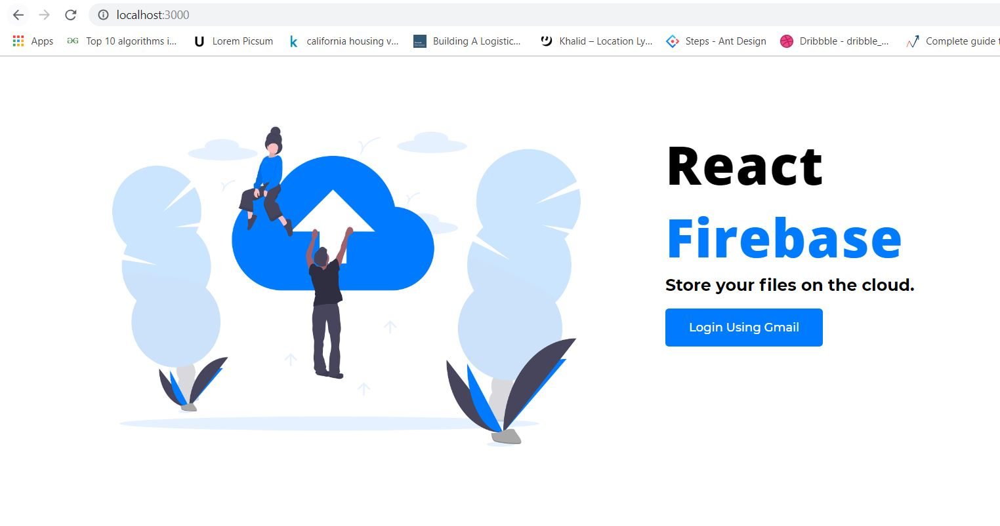

# React-Firebase-Storage
  The Cloud Storage app as the name suggests store the data which can be in any file format like excel,docs, txt, jpeg, png, json etc. on the cloud. We provide a basic functionality to upload, download and delete the files as well as user authentication so that only authentic users can use these functionalities.

## Getting Started
  clone or download the file. Traverse to the directory containing the project in your command prompt. use `npm start` to start the project it will automatically open the application on your default browser at `localhost:3000`.



### Prerequisites

After Downloading the project make sure to have following environment present on your system


[Node JS](https://nodejs.org/en/download/) - The Environment used download and install depending on your operating system

Also make sure to have a `Firebase Project` 


### Installing

When you have your environment ready  Traverse to the directory containing the project in your command prompt then enter following commands.

```
npm install - installs all the dependencies present
npm start   
```

Also configure your firebase project


- Turn on Google Authentication from Firebase Authentication [Google Authenticatio](https://firebase.google.com/docs/auth/web/google-signin).
- Initialize Firebase Storage and Firebase Realltime database. Make sure to allow all read and writes during development.
- Copy and the [Firebase Configuration](https://firebase.google.com/docs/web/setup) in `src/config/store`


You are ready to go :wink:


